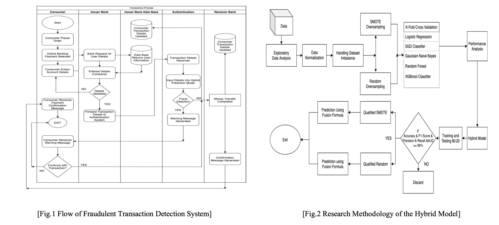
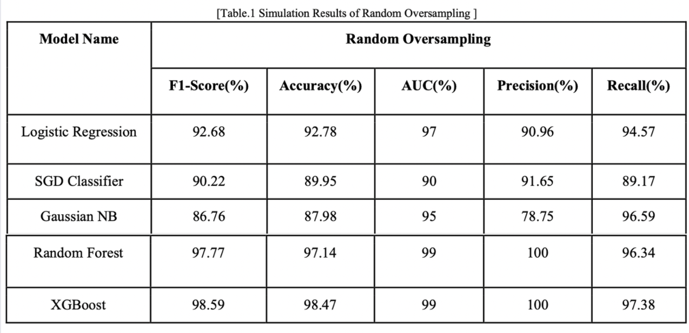
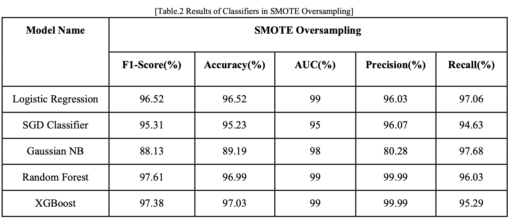
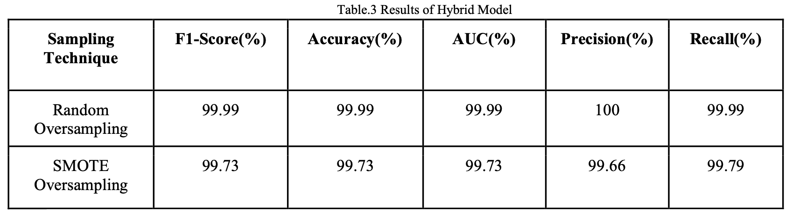
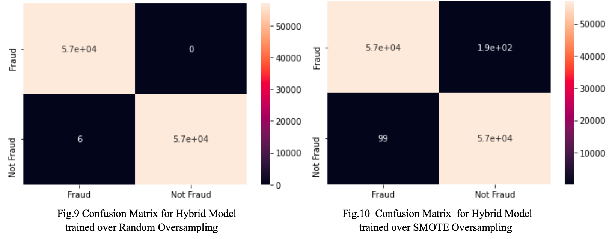

<h1 align="center"> Credit Card Fraud Detection </h1>

This Repository contains the official code used for the paper ['Detecting Fraudulent Transactions using Hybrid Fusion Techniques'](https://ieeexplore.ieee.org/document/9664719) - 2021 3rd International Conference on Electrical, Control and Instrumentation Engineering (ICECIE)

## Abstract of the work

Fraud is one of the most extensive ethical issues in the Financial (Banking) industry. The research aims to create a robust model for predicting fraudulent transactions based on the transactions made by the consumer in the past and present, compare as well as analyse different algorithms that best suit our needs. This paper also focuses on handling the imbalance in the datasets as well as creating a Machine Learning model with high Accuracy, F1-score, AUC, Precision as well as Recall which is achieved using a fusion method in which models are selected from the tested classifiers like Logistic Regression, XGBoost, Random Forest Classifier, Fusion Model, Gaussian NB, and SGDClassifier. Only the models with values of every metric above a certain threshold are selected to churn out maximum performance from the model. The model proposed in this paper uses a probability-based weighted average function for the prediction of fraudulent transactions which yielded a 99% score over all the considered metrics.

### Flowchart of Proposed Method



### Experimental Results

1. Individual Model Performance on Random Oversampling

2. Individual Model Performance on SMOTE Oversampling

3. Hybrid Model Performance on Random and SMOTE Oversampling

4. Confusion Matrix for Hybrid Models


### Citation

```py
Authors: Y. Shinde, A. S. Chadha and A. Shitole, 
Paper Title: "Detecting Fraudulent Transactions using Hybrid Fusion Techniques," 
Conference Name: 2021 3rd International Conference on Electrical, Control and Instrumentation Engineering (ICECIE), 
Year: 2021, pp. 1-10, 
DOI: doi: 10.1109/ICECIE52348.2021.9664719.
```
